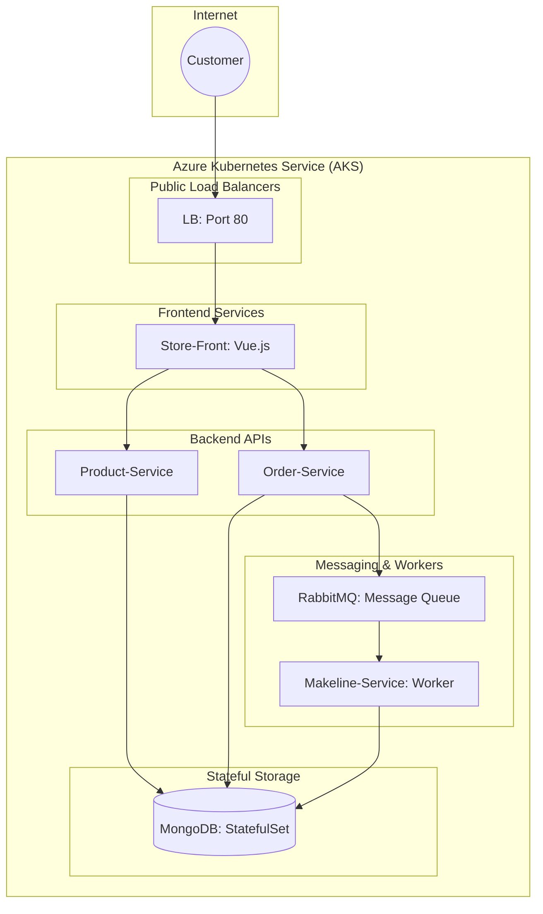

# Best Buy Cloud-Native Microservices Project


##Project Overview

 The project demonstrates a transition to a microservices architecture to improve scalability and reliability. The entire stack is deployed on **Azure Kubernetes Service (AKS)**.

### Application Components

  * **Store-Front**: Customer-facing web app (Vue.js).
  * **Store-Admin**: Employee management portal.
  * **Order-Service**: Backend API for processing customer orders.
  * **Product-Service**: Backend API for inventory and product catalog.
  * **Makeline-Service**: Background worker for order fulfillment.
  * **Database**: MongoDB (StatefulSet) for persistent storage.

-----

##  System Architecture

The application uses a decoupled architecture where services communicate via REST APIs and message queues.
## System Architecture


-----

##  Links & Image Registry

| Service | GitHub Repository | Docker Hub Image (ARM64) |
| :--- | :--- | :--- |
| **Store-Front** | [Link](https://github.com/harshdeep1230/store-front-L8) | `harshdeep1230/store-front:v1` |
| **Product-Service** | [Link](https://github.com/harshdeep1230/product-service-L8) | `harshdeep1230/product-service:v1` |
| **Order-Service** | [Link](https://github.com/harshdeep1230/order-service-L8) | `harshdeep1230/order-service:v1` |
| **Makeline-Service**| [Link](https://github.com/harshdeep1230/makeline-service-L8) | `harshdeep1230/makeline-service:v1` |

-----

##  Deployment Instructions

### 1\. Prerequisites

  * AKS Cluster configured with `Standard_D2ps_v6` nodes (ARM64).
  * `kubectl` CLI connected to the cluster.

### 2\. Deploy the Stack

Navigate to the root directory and apply the manifests:

```powershell
kubectl apply -f DeploymentFiles/bestbuy-apps.yaml
```

### 3\. Accessing the Apps

Run the following to find the **EXTERNAL-IP**:

```powershell
kubectl get services
```

  * **Store Front**: `http://<EXTERNAL-IP>`
  * **Store Admin**: `http://<EXTERNAL-IP>:8080`

-----

##  CI/CD Implementation

The project implements a **GitHub Actions** pipeline to automate the build and deployment process.

  * **Automation**: Triggered on every `push` to the `main` branch.
  * **Multi-Arch Support**: Builds images specifically for **linux/arm64** to ensure compatibility with AKS nodes.
  * **Security**: Uses GitHub Secrets for Docker Hub and Azure credentials.

-----

##  Author

**Harshdeep Puri**

